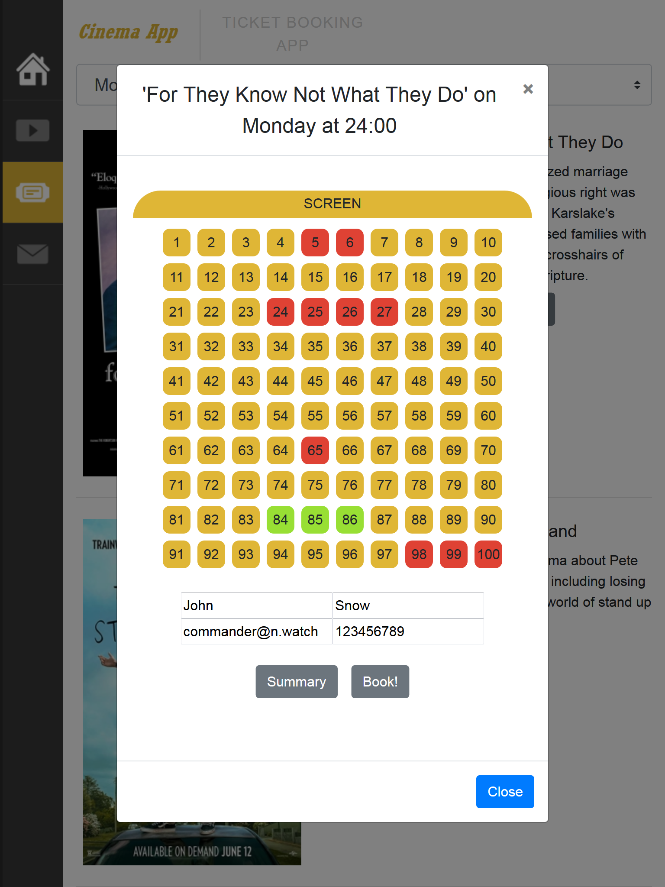
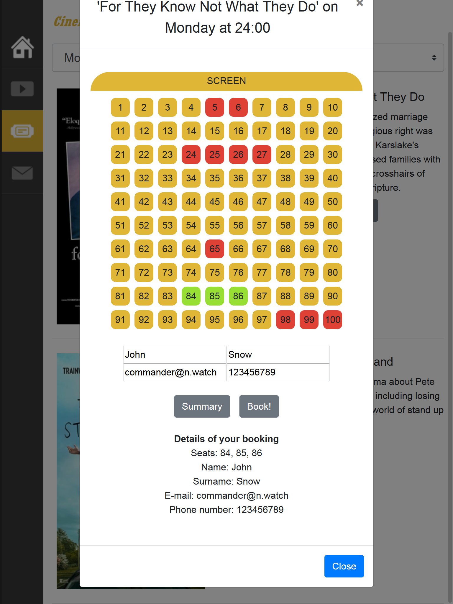
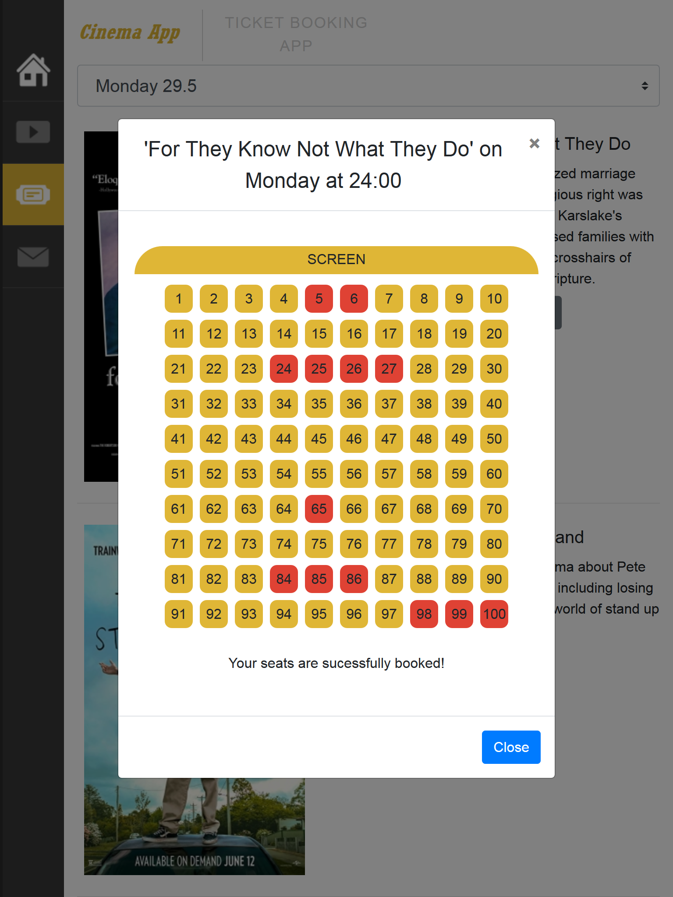
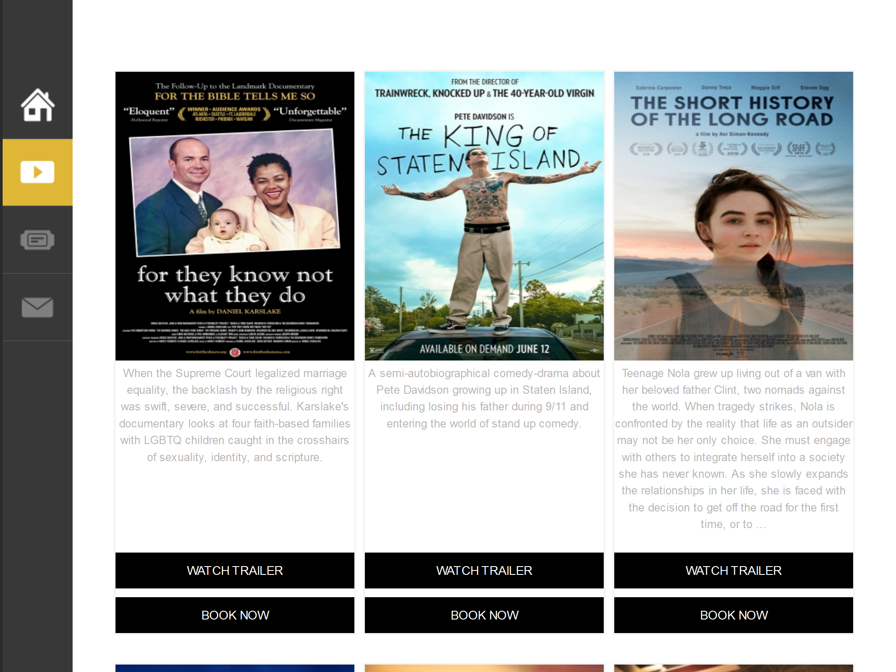
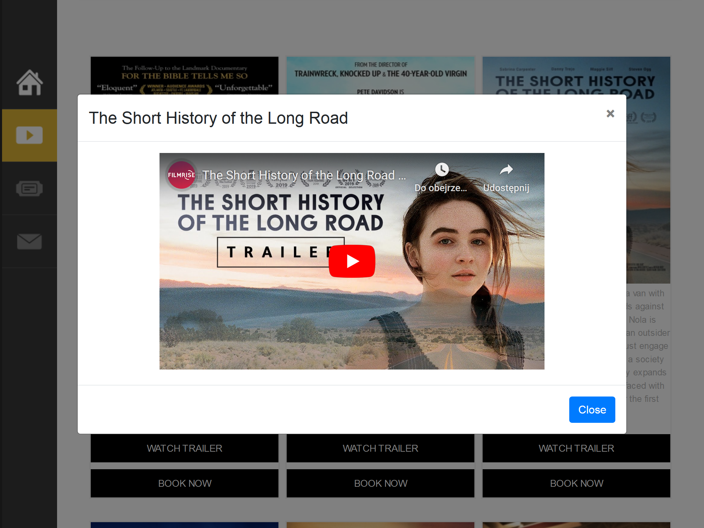
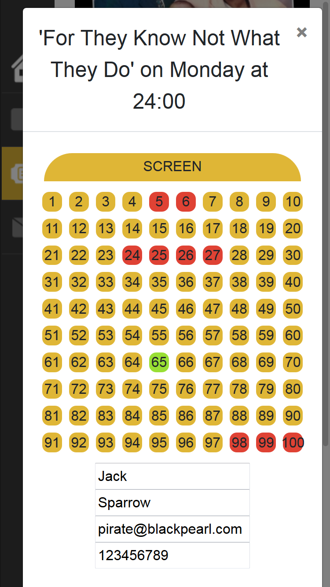
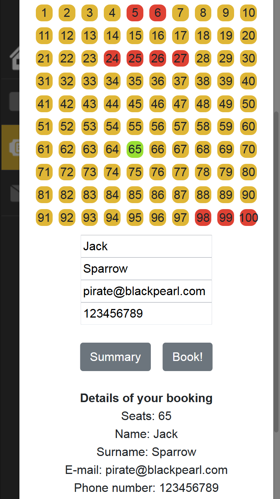
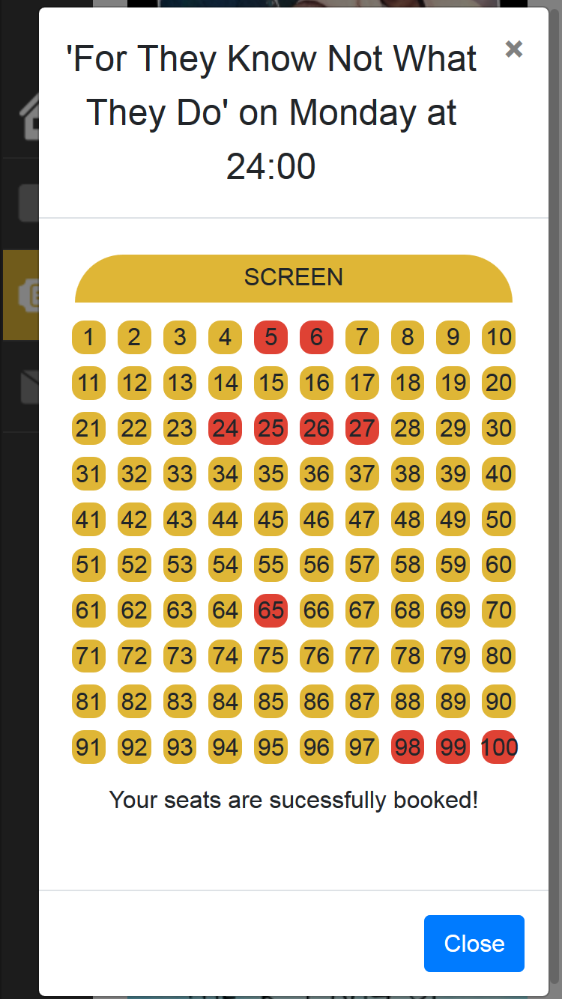
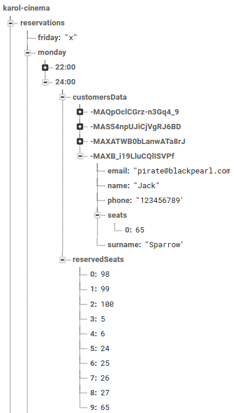

<h1 align="center"> React Cinema Booking Application </h1>

LIVE DEMO: https://reactcinemabookingbykarol.web.app 

SCREENSHOTS:

1. Tablet views
</img>
</img>
</img>
</img>
</img>

2. Mobile views
</img>
</img>
</img>
</img>

3. Customer's data and reservation posted to database - confirmation
</img>

